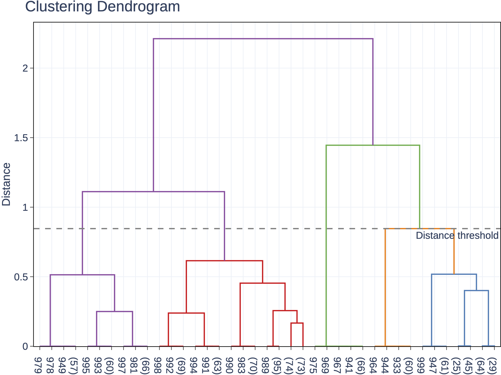

# Trace Clustering

> **Trace Clustering** is a Python library for clustering traces which are defined as sequences of features. Trace Clustering supports different feature types: numeric, vector, symbolic and multi-symbolic. It provides different distance metrics / algorithms and uses Agglomerative Hierarchical Clustering (HAC) to split traces into different clusters. 


- [Installation](#installation)
- [Dependencies](#dependencies)
- [1. Split Data [Optional]](#1-split-data-optional)
  - [Usage](#split-usage)
  - [Output](#split-output)
- [2. Embeddings](#2-embeddings)
  - [Numeric Features](#numeric-features)
  - [Symbolic Features](#symbolic-features)
  - [Usage](#embed-usage)
  - [Output](#embed-output)
- [3. Combine Embeddings [Optional]](#3-combine-embeddings-optional)
  - [Usage](#combine-usage)
  - [Output](#combine-output)
- [4. Distances](#4-distances)
  - [Usage](#dist-usage)
  - [Output](#dist-output)
- [5. Clustering](#5-clustering)
  - [Usage](#cluster-usage)
  - [Output](#cluster-output)
    - [External Evaluation](#external-evaluation)
    - [Internal Evaluation](#internal-evaluation)
- [License Notice](#license-notice)
- [Support](#support)
- [Acknowledgements](#acknowledgements)

# Installation

```shell
git checkout https://github.com/SRI-AIC/trace-clustering.git
cd feature-extractor
pip install -e .
```

# Dependencies

- `numpy`
- `scipy`
- `pandas`
- `plotly`
- `scikit-learn`
- `tqdm`
- `fastdtw` (opional, required only to cluster using Dynamic Time Warping)

# 1. Split Data [Optional]

This is an optional step to split a trace dataset to be later clustered into a training and test set.

## <a name="split-usage">Usage</a>

To split a trace dataset we use:

```bash
python -m trace_clustering.bin.split_data 
    --input ${INPUT_FILES_LIST}
    --output ${OUTPUT_DIR}
    [--partitions ${PARTITION_LIST}]
    [--seed ${SEED}] 
    [--split ${SPLIT_RATIO}]
    [--trace-col ${TRACE_COLUMN}]
    [--timestep-col ${TIMESTEP_COLUMN}]
    [--start-col ${START_COLUMN}] 
    [--clear {"True", "False"}]
    [--verbosity {"debug", "info", "warning", ...}]
```

where:

- `input`: list of paths to either CSV or Pandas (`pd.Dataframe`) dataset files containing the feature sequences (traces), where the columns are the features and the rows contain the feature values sequences. Each file is considered a different data "partition". The script expects the following columns to be present in the input dataset:
  - `"File"`: the row values contain the unique identifier of the trace the row belongs to. Can be overridden with the `--trace-col` argument.
  - `"Timestep"`: the values specify the index of the step (e.g., time based) within the trace the row belongs to. Can be overridden with the `--timestep-col` argument.
  - All other columns are considered to hold the values of the different features.
- `output`: path to the directory in which to save results.
- `partitions`: optional list with the partition (ground-truth) labels for each file provided in input.
- `seed`: seed used for splitting the data randomly (default: `0`).
- `split`: the ratio (value in `(0,1]`) of input data to be used for clustering. The remaining trace data will be saved in a separate file.
- `trace-col`: the name of the column in the input files specifying the traces' unique identifier (file name, index, etc.; default: `"File"`).
- `timestep-col`: the name of the column in the input files specifying the timestep index within each trace/sequence (default: `"Timestep"`).
- `start-col`: the index of first the column in the input files corresponding to a feature, i.e., not metadata. It is assumed that subsequent columns are also feature columns (default: `2`).
- `clear`:  whether to clear output directories before generating results (default: `False`)
- `verbosity`: verbosity level for the `logging` module messages (default: `info`).

## <a name="split-output">Output</a>

The above script generates the following data in the directory specific by `--output`:

- `all-traces-train.pkl.gz`: contains a Pandas `Dataframe` used for clustering (training) with all features (columns) for all traces (rows) to be clustered. This corresponds to a unified version of all input datasets.  
- `all-traces-test.pkl.gz`: (produced when `split<1`) the same as above but containing the test/validation traces.

# 2. Embeddings

The library provides different types of *trace embeddings* techniques that transform each trace into a vector representation for clustering. 

## Numeric Features

- **Numeric (`numeric`):** converts all features of a trace to a numeric value and passes through the numeric sequences. To be used with a distance function comparing numeric traces (sequences of (multi-dimensional) feature vectors) rather than a vector representation for the whole trace.
- **Feature counts (`feature_counts`):** computes a trace embedding with the (possibly time-discounted) total counts for all feature values.
- **Mean (`mean`):** computes a trace embedding with the mean value of each numeric feature.

> Note: symbolic features (`string`/`object`) are converted to numeric ones via one-hot encoding, Boolean features are converted to the corresponding `{0,1}` value. 

## Symbolic Features

- **SGT by feature (`sgt_by_feature`):** computes a trace embedding using Sequence Graph Transforms (SGT) [1] that finds pairwise temporal relationships between all feature values (symbols) *within* each feature, i.e., does not compute across-feature relationships. Each trace is then considered an item-sequence. The pairwise temporal relationship values for each feature are then concatenated to form the embedding of a trace.
- **SGT using feature sets (`sgt_feature_sets`):** extends SGT by computing temporal relationships between feature values (symbols) *between* all pairs of features. This is done by considering each element in a trace a feature set (itemset sequence) rather than considering only individual features (item sequence).

## <a name="embed-usage">Usage</a>

To compute an embedding representation from a set of traces (sequences of features), we use:

```bash
python -m trace_clustering.bin.get_embeddings 
    --input ${INPUT_FILE}
    --output ${OUTPUT_DIR}
    [--features-filter ${FILTER_FILE}] 
    [--filter-constant {"True", "False"}]
    [--time-max ${TIME_MAX}]
    [--embedding-algorithm {"numeric", "feature_counts", "mean", "sgt_by_feature", "sgt_feature_sets"}]
    [--kappa ${KAPPA}] 
    [--lengthsensitive {"True", "False"}]
    [--discount ${DISCOUNT}] 
    [--processes ${NUM_PROCESSES}]
    [--clear {"True", "False"}]
    [--verbosity {"debug", "info", "warning", ...}]
```

where:

- `input`: path to the Pandas dataset (`pd.Dataframe`) pickle file (`.pkl`) containing feature sequences (traces). The script expects the following columns to be present in the input dataset:
  - `Trace index`: the row values contain the index of the trace the row belongs to. 
  - `Timestep`: the temporal index (timestep) of each entry (vector or itemset) in the trace.
  - `Trace ID`: the identifier of the trace the row belongs to, e.g., the episode number or file name (this is copied from the original dataset as specified by the `--trace-col` argument of the `split_data` script). 
  - `Partition`: the partition label that each trace belongs to (as specified by the `--partition` argument of the `split_data` script).
  - The remaining columns are the features used for clustering.
- `output`: path to the directory in which to save results.
- `features-filter`: path to a Json file (`.json`) containing a list with the names of the features to be used for clustering (thereby excluding all features not listed in the file).
- `filter-constant`: whether to remove features whose value is constant across all traces in the dataset (default: `True`).
- `time-max`: maximum number of timesteps in each trace used for embedding calculation. `-1` (default) will use all timesteps.
- `embedding-algorithm`: embedding algorithm used to compute distances between traces. See details about the different options below (default: `sgt_feature_sets`).
- `kappa`: (used with `--embedding-algorithm sgt_*`) tuning parameter for SGT, `kappa > 0`, to change the extraction of long-term dependency. The higher the value the lesser the long-term dependency captured in the embedding. Typical values for kappa are 1, 5, 10. Used with `--embedding-algorithm sgt_*` (default: `1`).
- `lengthsensitive`: set to `True` if the embedding produced by SGT should have the information of the length of the sequence. If `False` (default) then the embedding of two sequences with similar pattern but different lengths will be the same. `False` is similar to length-normalization. Used with `--embedding-algorithm sgt_*`.
- `discount`: the discount factor to be applied to feature counts, i.e., such that features appearing earlier in a trace have a higher weight than those appearing later in the trace. Used with `--embedding-algorithm feature_counts` (default: `1`).
- `processes`: number of processes used for parallel processing. Value `< 1` uses all available cpus (default: `1`)
- `clear`:  whether to clear output directories before generating results (default: `False`)
- `verbosity`: verbosity level for the `logging` module messages (default: `info`).

## <a name="embed-output">Output</a>

The above script generates the following data in the directory specified by `--output`:

- `embeddings.pkl.gz`: contains a Pandas `Dataframe` object with the embedding  representations for all traces. Column labels contain the names of the resulting embedding features.
- `features/constants/dropped/duplicates.json`: Json files containing the list of features considered for the embedding representation, the features with constant values across all traces, the dropped features and the duplicated feature pairs, respectively.

# 3. Combine Embeddings [Optional]

## <a name="combine-usage">Usage</a>

To combine the embedding representations produced by different algorithms from the same traces dataset we can use:

```bash
python -m trace_clustering.bin.combine_embeddings 
    --input ${INPUT_FILES}
    --output ${OUTPUT_DIR}
    [--clear {"True", "False"}]
    [--verbosity {"debug", "info", "warning", ...}]
```

where:

- `input`: list of paths to the `embeddings.pkl.gz` files produced by the `get_embeddings` script for each. algorithm containing the embedding representations for each trace.
- `output`: path to the directory in which to save results.
- `clear`: whether to clear output directories before generating results (default: `False`)
- `verbosity`: verbosity level for the `logging` module messages (default: `info`).

## <a name="combine-output">Output</a>

The above script generates the following data in the directory specified by `--output`:

- `embeddings.pkl.gz`: contains the Pandas `Dataframe` object with the combined embedding representations for all traces. Column labels contain the names of the resulting embedding features.

# 4. Distances

After computing the embedding representations for each trace we compute the pairwise distances between traces. The library supports the following distance metrics:

- **Euclidean (`euclidean`)**
- **Manhattan (`manhattan`)**
- **Cosine (`cosine`)**
- **Minkowski (`minkowski`)**
- **Dynamic Time Warping (`dtw`):** computes the distance between numeric traces by trying to align them at each step of the sequence. A secondary distance metric is used during the alignment process. This option should be used together with the `--embedding-algorithm "numeric"`  option when executing the `get_embeddings` script.

## <a name="dist-usage">Usage</a>

To compute the pairwise trace distance matrix (after computing the embedding representations), we use:

```bash
python -m trace_clustering.bin.get_distances
    --embeddings_file ${EMBEDDINGS_FILE}
    --output ${OUTPUT_DIR}
    [--distance_metric {"euclidean","manhattan","cosine","minkowski","dtw"}]
    [--p_norm ${P_NORM}]
    [--dtw_dist ${DIST_FUNCTION|P_NORM}]
    [--format ${IMG_FORMAT}]
    [--processes ${NUM_PROCESSES}]
    [--clear {"True", "False"}]
    [--verbosity {"debug", "info", "warning", ...}]
```

where:

- `embeddings_file`: path to the `embeddings.pkl.gz` file containing the embeddings `DataFrame` for all traces, as produced by the `get_embeddings` script.
- `output`: path to directory in which to save results.
- `distance_metric`: distance metric used to compute distances between trace embeddings (see options above; default: `"cosine"`).
- `p_norm`:  the `p`-norm to apply for Minkowski distance computation (used with `--distance_metric "minkowski"`; default: `2`).
- `dtw_dist`: the name of distance function within the [`scipy.spatial.distance`](https://docs.scipy.org/doc/scipy/reference/spatial.distance.html) module used to compare and align traces at each step of the trace during DTW computation. If an integer is provided, then this corresponds to the `p`-norm of the Euclidean distance (used with `--distance_metric "dtw"`; default: `"cosine"`).
- `format`: format of resulting images (default: `"png"`).
- `processes`: number of processes used for parallel processing. Value `< 1` uses all available cpus (default: `1`).
- `clear`: whether to clear output directories before generating results (default: `False`).
- `verbosity`: verbosity level for the `logging` module messages (default: `info`).

## <a name="dist-output">Output</a>

The above script generates the following data in the directory specified by `--output`:

- `trace-distances.npz`: a Numpy array with a matrix containing the pairwise distances between all traces.

- `trace-distances.${FORMAT}`: a plot of the distances' matrix like the one depicted below, where traces are unsorted, *i.e.*, their order is the one in which they appeared in the input datasets:
  
  

- The script also computes the **Hopkins statistic** (https://pubs.acs.org/doi/abs/10.1021/ci00065a010) which measures the clustering tendency of the input trace datasets. This statistic does not depend on the distance metric chosen, but rather on geometric properties of the embedding representation that was computed by the `get-embeddings` script. The statistic and its interpretation are printed to the console and output log file (`get-distances.log`), e.g.:
  
  ```
  ========================================
  Computing Hopkins statistic from the embeddings...
      H=0.96
      Trace data has a high tendency to cluster
  ```

# 5. Clustering

The library utilizes *Hierarchical Agglomerative Clustering* (HAC) to cluster traces. A good introduction to the subject can be found at: https://scikit-learn.org/stable/modules/clustering.html#hierarchical-clustering.

## <a name="cluster-usage">Usage</a>

After computing the pairwise trace distance matrix, we can perform trace clustering by running:

```bash
python -m trace_clustering.bin.cluster_traces
    --distances ${DISTANCES_FILE}
    --traces ${TRACES_FILE}
    --embeddings_file ${EMBEDDINGS_FILE}
    --output ${OUTPUT_DIR}
    [--linkage {"complete", "average","single"}] 
    [--n_clusters ${N_CLUSTERS}]
    [--distance_threshold ${DISTANCE_THRESHOLD}]
    [--eval_clusters ${MAX_CLUSTERS}]
    [--format ${IMG_FORMAT}]
    [--processes ${NUM_PROCESSES}]
    [--clear {"True", "False"}]
    [--verbosity {"debug", "info", "warning", ...}]
```

where:

- `distances`: path to the `trace-distances.npz` Numpy binary compressed file containing the distances' matrix between all traces computed by the `get_distances` script.
- `traces`: path to the file containing the features for all traces (input dataset, e.g., the `all-traces-train.pkl.gz` file produced by the `split_ddata` script.
- `embeddings_file`: path to the `embeddings.pkl.gz` file containing the embeddings `DataFrame` for all traces, as produced by the `get_embeddings` script.
- `output`: path to the directory in which to save results.
- `linkage`: which linkage criterion to use. The linkage criterion determines which distance to use between sets of observation. The algorithm will merge the pairs of cluster that minimize this criterion (default: `"average"`). See details at: https://scikit-learn.org/stable/modules/clustering.html#different-linkage-type-ward-complete-average-and-single-linkage.
- `n_clusters`: the number of clusters used to partition the data. A value of `-1` will make the algorithm use the value specified by `--distance_threshold` to determine the number of clusters (default: `3`).
- `distance_threshold`: the linkage distance threshold above which clusters will not be merged (default: `0.025`). This argument is ignored if `--n_clusters` is specified.
- `eval_clusters`: maximum number of clusters for which to perform internal and external clustering evaluation (default: `7`).
- `format`: format of resulting images (default: `"png"`).
- `processes`: number of processes used for parallel processing. Value `< 1` uses all available cpus (default: `1`).
- `clear`: whether to clear output directories before generating results (default: `False`).
- `verbosity`: verbosity level for the `logging` module messages (default: `info`).

## <a name="cluster-output">Output</a>

The above script generates the following data in the directory specified by `--output`:

- `cluster-traces.csv`: the list of trace indices belonging to each cluster.

- `trace-distances.${FORMAT}`: a plot of the distances' matrix like the one below, where traces are grouped by cluster and sorted according to the order in which they were merged within each cluster:
  
  

- `clustering-dendrogram.${FORMAT}`: a plot of the dendrogram (hierarchical structure of clusters) like the one below, generated by the HAC algorithm. `clustering-dendrogram.csv` file contains the corresponding linkage matrix with the dendrogram structure.
  
  

- `clustering-distances.${FORMAT}`: a plot like the one below of the distances (y-axis) at which each number of clusters (x-axis) was found via the HAC algorithm. Note the inverted x-axis to better visualize the bottom-up approach of the algorithm. `clustering-distances.csv` contains the corresponding data in a table format.
  
  

- `traces`: this sub-directory contains files named `cluster-X.tar.gz`, each containing the original trace data (including timesteps and index columns and  the features) for all the traces in each cluster.

### External Evaluation

The `external eval` folder contains the results of performing **external evaluation** to the clustering results. The script uses the ground-truth trace partitions (corresponding to the labels in the `Partition` column for each trace, e.g., as specified by the `--partition` argument of the `split_data` script) to assess the match between those partitions and the partitions resulting from the clustering algorithm

- Several external clustering evaluation metrics are computed for different number of clusters in the range `[2, ${MAX_CLUSTERS}]`. The list and their description can be found at: https://scikit-learn.org/stable/modules/clustering.html#clustering-performance-evaluation. Here is an example for a plot of the adjusted mutual information metric:
  
  

- The `cluster-X.${FORMAT}` files containing bar charts like the one below which plot the distribution of traces over the ground-truth partitions for each cluster:
  
  

### Internal Evaluation

The `internal eval` folder contains the results of performing internal evaluation to the clustering results, *i.e.*, without any ground-truth information. Several internal clustering evaluation metrics are computed for different number of clusters in the range `[2, ${MAX_CLUSTERS}]`. The list and their description can be found at: https://scikit-learn.org/stable/modules/clustering.html#silhouette-coefficient. Here is an example for a plot of the Calinski-Harabasz index:


# License Notice

The code is provided under the GPLv3 license (see [full license file](LICENSE.md)). To use the code under a different set of licensing terms, please contact [SRI International](https://www.sri.com/)'s licensing department at [licensee-ops@sri.com](mailto:licensee-ops@sri.com).

# Support

If you have questions about using this package or find errors in the code you can post an issue or contact [Pedro Sequeira](mailto:pedro.sequeira@sri.com)  or [Melinda Gervasio](mailto:melinda.gervasio@sri.com).

# Acknowledgements

This material is based upon work supported by the Defense Advanced Research Projects Agency (DARPA) under Contract No. HR001119C0112.
